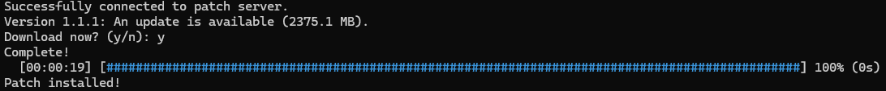

# Patch Delta Packer

A high-performance patch generation and deployment system written in Rust.

---

## Overview

This patch delta packer is a high-performance patch generation and deployment system written in Rust. It enables developers to efficiently distribute software updates by generating differential patch packages, allowing clients to download only the data required to update from their current version to the latest release.
The system uses streaming architecture, asynchronous networking, and concurrent processing to minimise memory usage while improving patch generation, installation, and download performance. Additionally, download and installation recovery is supported.

The project consists of three standalone applications which together form a complete update pipeline.

| Application | Description |
|------------|-------------|
| **Patch Builder** | Generates version manifests and differential patch packages. |
| **Patch Server** | Serves patch packages to connected clients using a custom TCP protocol. |
| **Launcher** | Detects available updates, downloads the required patch chain, verifies integrity, and installs updates safely. |

---

## Features

### Architecture & Performance

- Concurrent operations is supported through a **custom size thread pool**, allowing for high potential performance in certain expensive operations.
- **Streaming file processing** minimises memory usage during patch generation and downloads.
- Downloading happens via an **asynchronous Tokio connection** to support multiple parallel requests with no server overhead.
- **File chunking** and **chunk differentiation** are used to reduce file comparisons, replacements and minimise patch sizes.

### User Experience

- Clients require **only the installation directory of the target software** - the server will handle update discovery automatically.
- Server is able to detect if a client holds an outdated version and automatically **generate a patch chain** that updates the client to the latest known version.
- Developers can create patches using **a single command**, with the code automatically generating manifests if they are unavailable.
- Users can visually see the progress of downloading and installs with an ETC to know when their update is expected to be ready.

### Reliability & Recovery

- Downloads will automatically **resume from the last downloaded byte** next time the launcher is run using a resume offset.
- Downloads have their integrity verified via SHA-256, ensuring users never own a corrupted patch.
- Download resuming and offset is **properly validated** with failsafe backup operations to ensure that clients are never stuck in a corrupted download state.
- File installations happen atomically, using **backups and temporary extensions** and only committing changes when the entire install has been confirmed, ensuring that the software is **always in a useable state**.
- Interrupted installations are **automatically recovered** during the next launcher execution.

### Scalability & Extensibility

- **Stateless request handling** minimises server state, simplifying recovery and allowing the server to scale to multiple concurrent clients.
- **Configurable chunk sizes** allow developers to balance patch size, generation speed, and memory usage depending on their application.
- Worker pool implemented with **generics** allows future operations to easily support concurrency.
- Clear **separation of responsibilities** between the launcher, server and packer, simplifying the overall architecture.

---

# Architecture

The update pipeline consists of three independent applications.

```
Software Version A
      │
      ▼
Generate Manifest
      │
      ▼
Manifest A

Software Version B
      │
      ▼
Generate Manifest
      │
      ▼
Manifest B

Manifest A compares Manifest B
           │
           ▼
Generate Patch Package
           │
           ▼
      Patch Server
           │
           ▼
        Launcher
           │
           ▼
   Download → Verify → Install
```

---

## Patch Builder

The Patch Builder is responsible for generating version manifests and differential patch packages.

Manifest generation recursively scans a game directory, splitting files into configurable chunks and generating SHA-256 hashes for each chunk.

Patch generation compares two manifests and determines:

- Added files
- Deleted files
- Modified files
- Modified chunks

Only the required data is stored inside the generated patch package.

---

## Patch Server

The Patch Server exposes patch packages over a lightweight asynchronous TCP server.

When a launcher connects, the server:

1. Determines the client's current version.
2. Calculates the required patch chain.
3. Streams each patch directly to the client.
4. Supports resumable downloads through byte offsets.

Because requests are stateless, the server maintains minimal per-client information while supporting multiple concurrent connections.

---

## Launcher

The Launcher is responsible for updating the client's installation.

For every required patch it performs:

1. Download patch
2. Verify SHA-256 checksum
3. Install patch safely
4. Continue to the next patch

Downloads automatically resume if interrupted.

Installation progress is displayed through a unified progress bar spanning downloading, verification and installation.

---

## Installer

The installer is designed to be crash-safe.

Rather than modifying files directly:

1. Temporary files are prepared.
2. Original files are backed up.
3. Files are atomically swapped.
4. Backups are removed after successful installation.

If installation is interrupted, backup files are detected during the next launcher execution and automatically restored. This ensures the software is **always in a useable state**.

---

# Benchmarks

The following benchmarks were run under a controlled environment, using a **Ryzen 5 3600** CPU and an SSD.
Because the project uses streaming files between layers to save memory usage, parallel performance yielded **poorer performance** than single threaded performance on a HDD, due to higher disk thrash overhead.

## Manifest Generation

Chunk Size used: 1MB

| Version | Game Size | Manifest Size | 1 Thread | 4 Threads |
|---------|----------:|--------------:|----------:|----------:|
| 1.1.0 | 8.5 GB | 436 KB | 14.3 s | 5.4 s |
| 1.1.1 | 10.5 GB | 536 KB | 17.1 s | 6.3 s |
| 1.1.2 | 11.5 GB | 597 KB | 18.8 s | 7.2 s |
| 1.1.3 | 12.2 GB | 633 KB | 20.7 s | 7.3 s |
| 1.1.4 | 12.6 GB | 660 KB | 22.7 s | 7.9 s |
| 1.1.5 | 12.8 GB | 674 KB | 21.7 s | 8.0 s |
| 1.1.6 | 13.0 GB | 682 KB | 22.1 s | 8.1 s |

Average speedup using 4 threads: _**~2.73x**_

---

## Patch Generation

| Update | Patch Size | 1 Thread | 4 Threads |
|--------|-----------:|----------:|----------:|
| 1.1.0 → 1.1.1 | 2.31 GB | 21.5 s | 13.1 s |
| 1.1.1 → 1.1.2 | 1.14 GB | 8.5 s | 6.1 s |
| 1.1.2 → 1.1.3 | 855 MB | 5.4 s | 4.2 s |
| 1.1.3 → 1.1.4 | 497 MB | 3.2 s | 2.4 s |
| 1.1.4 → 1.1.5 | 286 MB | 2.0 s | 1.5 s |
| 1.1.5 → 1.1.6 | 177 MB | 1.2 s | 0.9 s |

Average speedup using 4 threads: _**~1.39x**_

---

## Download & Installation

| Update | Patch Size | 1 Thread | 4 Threads |
|--------|-----------:|----------:|----------:|
| 1.1.0 → 1.1.1 | 2375 MB | 20.1 s | 18.5 s |
| 1.1.1 → 1.1.2 | 1170 MB | 8.4 s | 7.9 s |
| 1.1.2 → 1.1.3 | 855 MB | 5.8 s | 5.6 s |
| 1.1.3 → 1.1.4 | 497 MB | 3.2 s | 3.0 s |
| 1.1.4 → 1.1.5 | 286 MB | 1.9 s | 1.6 s |
| 1.1.5 → 1.1.6 | 177 MB | 1.2 s | 1.0 s |
| 1.1.0 → 1.1.6 | 5362 MB | 55.5 s | 48.9 s |

Average speedup using 4 threads: _**~1.11x**_

---
# Build

To run the code, you may either use the executables provided in the  `releases` section of this repository, or build your own.

If you want to build your own, you will need to have installed Rust and `cargo`.

On Windows:
- Use this link: https://win.rustup.rs/ to install Rust. This will automatically install `cargo` as well.
- `cd` to the directory containing the `cargo.toml` file and run the following command: `cargo build --release`.

On Linux:
- Use the command `curl https://sh.rustup.rs -sSf | sh` to download Rust. This will automatically install `cargo` as well.
- Run the following command: `cargo build --release` in the directory with this code.

After building, you can access the executables in the `target/release/` folder.

---

# Run

## Windows (PowerShell)

```powershell
.\patch_packer.exe --help
.\patch_server.exe --help
.\launcher.exe --help
```

- `patch_packer.exe manifest` will generate a manifest of the software folder, with the following arguments: `--root` (mandatory, describing the root directory of your software), and `--threads` (optional, default is 1)
- `patch_packer exe patch` will generate a patch given 2 versions of software, with the following arguments: `--old` (mandatory, describing the root directory of the old software), `--new` (mandatory, describing the root directory of the new software), `--output` (mandatory, describing the patch directory), and `--threads` (optional, default is 1)

- `launcher.exe` will run the launcher interface for the client, with the following arguments: `--threads` (optional, default is 1), and `--game` (mandatory, describing the root directory of the client's version of the software)
This argument is called _game_ as the patch packer was locally referred to as a game patcher, however it works on all software.

- `patch_server.exe` will run the server that hands patch info and patch bytes across the network to the client, with the following arguments: `--packages` (mandatory, describing the patch directory), and `--port` (optional, describes where the server connects to in order to retrieve patches, defaults to `127.0.0.1:8080` if not provided)

For example, to run the launcher with 4 threads, use the command: `.\launcher.exe --threads 4 --game "C:\Games\MyGame"`.

---

## Linux

```bash
chmod +x patch_builder patch_server launcher

./patch_builder --help
./patch_server --help
./launcher --help
```

For example, to run the launcher with 4 threads, use the command: `./launcher --threads 4 --game /home/user/MyGame`

---

# Usage

**Warning: The software file MUST contain `GameConfig.json` inside it, otherwise the below processes will not work!** 
This path can be renamed in `constants.rs`, but the file must be in json format, and include a field called `game_ver` to run. 
Otherwise, the code will be unable to deserialise and track your current software version.

- To use the packer, just provide the relevant arguments, and the code will automatically produce a manifest or patch depending on the arguments you have given it. You may additionally specify the number of threads you'd like to use.
- To use the launcher, the `server` must be running. Run the `server` and then the `launcher`, and if the connection is successful, you will see a success message on the launcher alongside a `connection established` message on the server.
- The launcher will request updates from the server. If there are updates available, the launcher will show the update size, and prompt the user to download the update. The user is free to cancel the update.
- If the user agrees, the downloading process will begin. If this process is interrupted, simply run the launcher again (you may have to run the server again). The remaining download will be displayed and it will automatically resume from where you left off.

---



---
